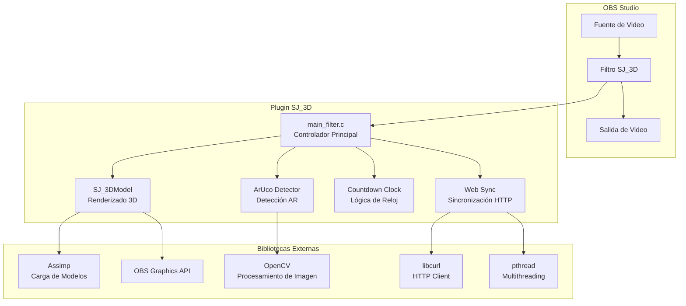
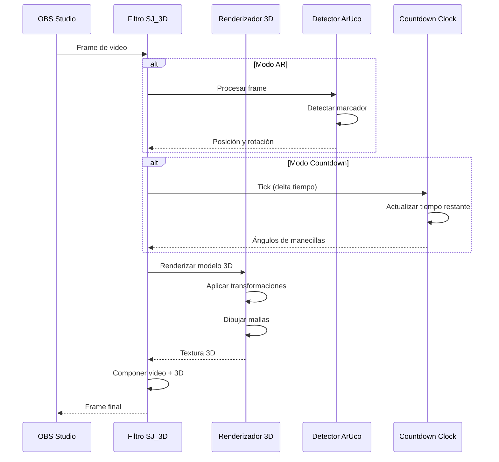
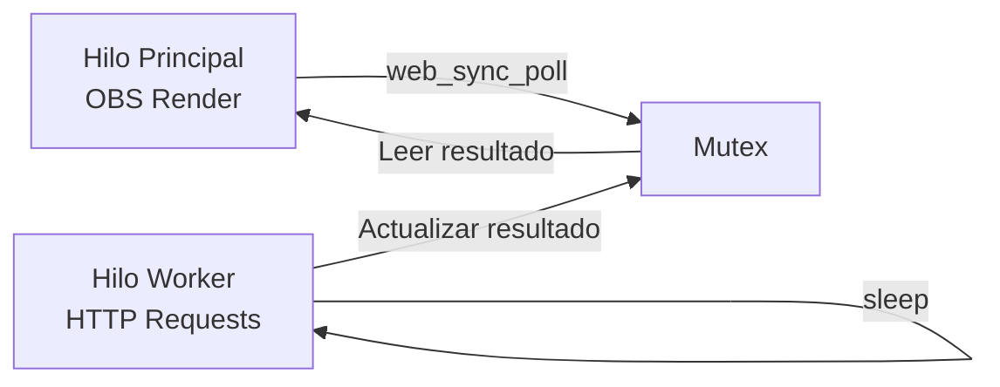

# Documentación Completa del Plugin OBS SJ_3D

## Índice

1. [Introducción](#introducción)
2. [Arquitectura del Sistema](#arquitectura-del-sistema)
3. [Módulos del Proyecto](#módulos-del-proyecto)
4. [Modos de Renderizado](#modos-de-renderizado)
5. [API y Referencia Técnica](#api-y-referencia-técnica)
6. [Configuración y Compilación](#configuración-y-compilación)
7. [Guía de Uso](#guía-de-uso)
8. [Dependencias](#dependencias)
9. [Estructura de Archivos](#estructura-de-archivos)
10. [Troubleshooting](#troubleshooting)

---

## Introducción

### ¿Qué es SJ_3D?

**SJ_3D** es un plugin avanzado para OBS Studio que permite renderizar modelos 3D sobre fuentes de video en tiempo real. El plugin soporta tres modos principales de operación:

- **Modo 3D**: Renderizado de modelos 3D con posición y rotación manual
- **Modo AR (Realidad Aumentada)**: Detección de marcadores ArUco para posicionamiento automático
- **Modo Countdown (Reloj)**: Visualización de cuenta atrás con manecillas animadas

### Características Principales

✅ **Renderizado 3D en Tiempo Real**
- Carga de modelos 3D en formatos OBJ, FBX, DAE, GLTF
- Soporte para texturas y materiales
- Transformaciones 3D completas (posición, rotación, escala)

✅ **Detección ArUco**
- Tracking de marcadores ArUco en tiempo real
- Calibración de cámara personalizable
- Múltiples diccionarios de marcadores soportados

✅ **Sistema de Countdown Avanzado**
- Modo de tres manecillas (horas, minutos, segundos)
- Modo de una manecilla (tiempo total)
- IDs de malla configurables
- Sincronización web opcional
- Posicionamiento AR o manual

✅ **Integración Completa con OBS**
- Funciona como filtro de video
- Compatible con cualquier fuente de OBS
- Configuración persistente
- Sin impacto en el rendimiento de OBS

---

## Arquitectura del Sistema

### Diagrama de Componentes



### Flujo de Datos



---

## Módulos del Proyecto

### 1. main_filter.c - Controlador Principal

**Ubicación**: `src/main_filter.c`

**Responsabilidad**: Punto de entrada del plugin, gestión del ciclo de vida y coordinación de módulos.

#### Estructura de Datos Principal

```c
struct cube_filter_data {
    // Contexto de OBS
    obs_source_t *source;
    gs_texture_t *texture;
    gs_zstencil_t *zstencil;
    
    // Modelo 3D
    struct Mesh *g_meshes;
    size_t g_mesh_count;
    float *model_width;
    float *model_height;
    
    // Transformaciones
    float pos_x, pos_y, pos_z;
    float scale, current_scale;
    float rotation_x, rotation_y, rotation_z;
    
    // AR (Realidad Aumentada)
    ArucoDetector *detector;
    ArucoResult last_result;
    float ar_offset_pos_x, ar_offset_pos_y, ar_offset_pos_z;
    float ar_offset_rot_x, ar_offset_rot_y, ar_offset_rot_z;
    
    // Countdown
    countdown_clock_t *countdown_clock;
    web_sync_t *web_sync;
    uint32_t countdown_duration_h, countdown_duration_m, countdown_duration_s;
    bool countdown_running;
    bool sync_enabled;
    char *sync_url;
    float sync_interval_sec;
    
    // Configuración de reloj
    int clock_mode;              // 0 = tres manecillas, 1 = una
    int mesh_id_dial;
    int mesh_id_hour_hand;
    int mesh_id_minute_hand;
    int mesh_id_second_hand;
    int mesh_id_single_hand;
    bool countdown_use_ar;
    
    // Modo de renderizado
    int mode;  // 0 = 3D, 1 = AR, 2 = Countdown
};
```

#### Funciones Principales

| Función | Descripción |
|---------|-------------|
| `filter_create()` | Inicializa el filtro, crea estructuras de datos |
| `filter_destroy()` | Libera recursos, limpia memoria |
| `filter_render()` | Renderiza el frame con el modelo 3D |
| `filter_tick()` | Actualiza estado (countdown, sincronización web) |
| `filter_video()` | Procesa frame para detección ArUco |
| `filter_update()` | Actualiza configuración desde la UI |
| `filter_properties()` | Define propiedades de la UI |
| `filter_save()` | Guarda configuración |
| `filter_load()` | Carga configuración |
| `filter_defaults()` | Establece valores por defecto |

---

### 2. SJ_3DModel - Renderizado 3D

**Ubicación**: [`src/SJ_3DModel.c`](file:///c:/Users/josem/Desktop/jose/tfg/TFG/obs-plugintemplate-master/src/SJ_3DModel.c), [`src/SJ_3DModel.h`](file:///c:/Users/josem/Desktop/jose/tfg/TFG/obs-plugintemplate-master/src/SJ_3DModel.h)

**Responsabilidad**: Carga de modelos 3D y renderizado con OpenGL a través de la API de OBS.

#### Estructura de Malla

```c
typedef struct Mesh {
    gs_vertbuffer_t *vb;      // Buffer de vértices
    gs_indexbuffer_t *ib;     // Buffer de índices
    uint32_t num_indices;
    uint32_t num_vertex;
    gs_texture_t *texture;    // Textura asociada
    
    // Centro y dimensiones
    float center_x, center_y, center_z;
    float depth_z;
    
    // Offsets de rotación automáticos
    float rot_offset_x, rot_offset_y, rot_offset_z;
    bool has_rot_offset;
    
    // Punto de pivote
    float pivot_x, pivot_y, pivot_z;
} Mesh;
```

#### API de Renderizado

**`load_model_c()`**
```c
bool load_model_c(const char *path, 
                  Mesh **g_meshes, 
                  size_t *g_mesh_count,
                  float **mesh_widths, 
                  float **mesh_heights);
```
- Carga modelo 3D usando Assimp
- Procesa vértices, normales, tangentes, UVs
- Crea buffers de GPU
- Detecta automáticamente orientación del modelo
- Soporta: OBJ, FBX, DAE, GLTF

**`render_model_c()`**
```c
void render_model_c(Mesh *g_meshes, 
                    size_t g_mesh_count, 
                    float *widths, 
                    float *heights, 
                    float scale, 
                    const float rvec[3],
                    bool detected, 
                    float offset_rot_x_deg,
                    float offset_rot_y_deg, 
                    float offset_rot_z_deg);
```
- Renderiza modelo 3D estándar
- Aplica transformaciones de posición, rotación, escala
- Soporta rotación desde ArUco (rvec)

**`render_model_clock_c()`**
```c
void render_model_clock_c(Mesh *g_meshes, 
                         size_t g_mesh_count,
                         float *widths, 
                         float *heights, 
                         float scale,
                         const float rvec[3], 
                         bool detected,
                         float offset_rot_x_deg,
                         float offset_rot_y_deg, 
                         float offset_rot_z_deg,
                         int clock_mode,
                         int mesh_id_dial, 
                         int mesh_id_hour,
                         int mesh_id_minute, 
                         int mesh_id_second,
                         int mesh_id_single,
                         const float *clock_hour_deg,
                         const float *clock_minute_deg,
                         const float *clock_second_deg,
                         const float *clock_single_deg);
```
- Renderiza modelo en modo reloj
- Aplica rotaciones específicas a manecillas según IDs de malla
- Soporta modo de tres manecillas y una manecilla

#### Pipeline de Renderizado

1. **Configuración de Contexto 3D**
   ```c
   gs_projection_push();
   gs_set_3d_mode(60.0f, 0.1f, 5000.0f);  // FOV, near, far
   gs_enable_depth_test(true);
   ```

2. **Transformaciones por Malla**
   ```c
   gs_matrix_push();
   gs_matrix_translate3f(-cx, -cy, -cz);  // Centrar en origen
   gs_matrix_scale3f(scale, scale, -scale);
   gs_matrix_rotaa4f(1.0f, 0.0f, 0.0f, M_PI);  // Flip Y
   ```

3. **Aplicar Rotaciones**
   - Rotaciones globales (offset_rot_x/y/z)
   - Rotaciones de manecillas (solo en modo reloj)
   - Rotación ArUco (si está detectado)

4. **Dibujar Geometría**
   ```c
   gs_effect_set_texture(image_param, m->texture);
   gs_load_vertexbuffer(m->vb);
   gs_load_indexbuffer(m->ib);
   gs_draw(GS_TRIS, 0, m->num_indices);
   ```

---

### 3. ArUco Detector - Detección de Marcadores

**Ubicación**: [`src/aruco_detector.cpp`](file:///c:/Users/josem/Desktop/jose/tfg/TFG/obs-plugintemplate-master/src/aruco_detector.cpp), [`src/aruco_detector.h`](file:///c:/Users/josem/Desktop/jose/tfg/TFG/obs-plugintemplate-master/src/aruco_detector.h)

**Responsabilidad**: Detección y tracking de marcadores ArUco usando OpenCV.

#### Estructura de Datos

```c
typedef struct ArucoResult {
    bool detected;
    float screen_pos_x;
    float screen_pos_y;
    float rvec[3];  // Vector de rotación (eje-ángulo)
    float tvec[3];  // Vector de traslación
} ArucoResult;
```

#### Diccionarios Soportados

| Diccionario | Descripción | Uso |
|-------------|-------------|-----|
| `ARUCO_DICT_ORIGINAL` | Diccionario original de ArUco | General |
| `ARUCO_DICT_4X4_100` | 4×4 bits, 100 marcadores | Marcadores pequeños |
| `ARUCO_DICT_5X5_100` | 5×5 bits, 100 marcadores | Balance tamaño/robustez |
| `ARUCO_DICT_6X6_100` | 6×6 bits, 100 marcadores | Mayor robustez |
| `ARUCO_DICT_7X7_100` | 7×7 bits, 100 marcadores | Máxima robustez |

#### API Principal

**Inicialización**
```c
ArucoDetector* initialize_aruco_detector(float marker_size,
                                         int dictionary_id,
                                         const char *calibration_path);
```

**Detección**
```c
bool process_frame_rgba(ArucoDetector *detector,
                       struct obs_source_frame *frame,
                       float screen_width,
                       float screen_height,
                       uint32_t frame_width,
                       uint32_t frame_height,
                       ArucoResult *result);
```

**Configuración**
```c
void set_marker_id(ArucoDetector *detector, int id);
void set_marker_size(ArucoDetector *detector, float size);
void set_marker_dictionary(ArucoDetector *detector, int dict_id);
void set_calibration_path(ArucoDetector *detector, const char *path);
```

#### Calibración de Cámara

El detector puede usar un archivo de calibración YAML con el formato:

```yaml
%YAML:1.0
image_width: 1920
image_height: 1080
camera_matrix: !!opencv-matrix
  rows: 3
  cols: 3
  dt: d
  data: [ fx, 0, cx,
          0, fy, cy,
          0, 0, 1 ]
distortion_coefficients: !!opencv-matrix
  rows: 1
  cols: 5
  dt: d
  data: [ k1, k2, p1, p2, k3 ]
```

---

### 4. Countdown Clock - Lógica de Reloj

**Ubicación**: [`src/countdown_clock.c`](file:///c:/Users/josem/Desktop/jose/tfg/TFG/obs-plugintemplate-master/src/countdown_clock.c), [`src/countdown_clock.h`](file:///c:/Users/josem/Desktop/jose/tfg/TFG/obs-plugintemplate-master/src/countdown_clock.h)

**Responsabilidad**: Gestión del estado del countdown y cálculo de ángulos de manecillas.

#### Estados del Countdown

```c
typedef enum countdown_state {
    COUNTDOWN_STATE_STOPPED = 0,   // Detenido, no iniciado
    COUNTDOWN_STATE_RUNNING,       // En ejecución
    COUNTDOWN_STATE_PAUSED,        // Pausado
    COUNTDOWN_STATE_FINISHED       // Finalizado (tiempo = 0)
} countdown_state_t;
```

#### API Completa

**Gestión del Ciclo de Vida**
```c
countdown_clock_t* countdown_clock_create(void);
void countdown_clock_destroy(countdown_clock_t *clock);
```

**Configuración**
```c
void countdown_clock_set_duration(countdown_clock_t *clock, 
                                  uint32_t total_seconds);
void countdown_clock_set_duration_hms(countdown_clock_t *clock,
                                      uint32_t hours, 
                                      uint32_t minutes, 
                                      uint32_t seconds);
void countdown_clock_set_dial_hours(countdown_clock_t *clock, 
                                    uint32_t max_hours);  // 12 o 24
```

**Control de Ejecución**
```c
void countdown_clock_start(countdown_clock_t *clock);
void countdown_clock_pause(countdown_clock_t *clock);
void countdown_clock_resume(countdown_clock_t *clock);
void countdown_clock_reset(countdown_clock_t *clock);
```

**Actualización**
```c
void countdown_clock_tick(countdown_clock_t *clock, float delta_seconds);
void countdown_clock_sync_remaining(countdown_clock_t *clock,
                                    uint32_t hours, 
                                    uint32_t minutes, 
                                    uint32_t seconds);
```

**Consulta de Estado**
```c
countdown_state_t countdown_clock_get_state(const countdown_clock_t *clock);
void countdown_clock_get_remaining(const countdown_clock_t *clock,
                                   uint32_t *out_hours, 
                                   uint32_t *out_minutes, 
                                   uint32_t *out_seconds);
double countdown_clock_get_remaining_seconds(const countdown_clock_t *clock);
```

**Cálculo de Ángulos**
```c
void countdown_clock_get_hand_angles(const countdown_clock_t *clock,
                                     float *hour_deg, 
                                     float *minute_deg,
                                     float *second_deg);
void countdown_clock_get_single_hand_angle(const countdown_clock_t *clock,
                                           float *single_hand_deg);
```

#### Algoritmo de Cálculo de Ángulos

**Tres Manecillas:**
```
tiempo_restante = horas * 3600 + minutos * 60 + segundos

// Manecilla de horas (dial de 12h por defecto)
horas_en_dial = horas % 12
fracción_hora = (minutos + segundos/60) / 60
valor_hora = horas_en_dial + fracción_hora
ángulo_hora = 360° × (1 - valor_hora / 12)

// Manecilla de minutos
fracción_minuto = segundos / 60
valor_minuto = minutos + fracción_minuto
ángulo_minuto = 360° × (1 - valor_minuto / 60)

// Manecilla de segundos
ángulo_segundo = 360° × (1 - segundos / 60)
```

**Una Manecilla:**
```
porcentaje_restante = tiempo_restante / duración_total
ángulo_único = 360° × (1 - porcentaje_restante)
```

> [!NOTE]
> Los ángulos se calculan en sentido antihorario (countdown) donde 0° = 12 en punto, 90° = 9 en punto, 180° = 6 en punto, 270° = 3 en punto.

---

### 5. Web Sync - Sincronización HTTP

**Ubicación**: [`src/web_sync.c`](file:///c:/Users/josem/Desktop/jose/tfg/TFG/obs-plugintemplate-master/src/web_sync.c), [`src/web_sync.h`](file:///c:/Users/josem/Desktop/jose/tfg/TFG/obs-plugintemplate-master/src/web_sync.h)

**Responsabilidad**: Sincronización del countdown con una API REST externa usando libcurl en un hilo dedicado.

#### Arquitectura de Threading



#### Estructura de Resultado

```c
typedef struct web_sync_result {
    bool valid;
    uint32_t hours;
    uint32_t minutes;
    uint32_t seconds;
} web_sync_result_t;
```

#### API

**Gestión**
```c
web_sync_t* web_sync_create(const char *url, float interval_seconds);
void web_sync_destroy(web_sync_t *sync);
```

**Configuración**
```c
void web_sync_set_url(web_sync_t *sync, const char *url);
void web_sync_set_interval(web_sync_t *sync, float seconds);
void web_sync_set_enabled(web_sync_t *sync, bool enabled);
```

**Polling (desde hilo principal)**
```c
bool web_sync_poll(web_sync_t *sync, web_sync_result_t *result);
```

#### Formato JSON Esperado

La API debe responder a GET con:

```json
{
  "hours": 1,
  "minutes": 30,
  "seconds": 45
}
```

#### Flujo de Sincronización

1. **Hilo Worker** hace petición HTTP cada `interval_seconds`
2. Parsea JSON usando `cJSON`
3. Actualiza `last_result` protegido por mutex
4. **Hilo Principal** llama `web_sync_poll()` en cada `filter_tick()`
5. Si hay resultado nuevo, sincroniza el countdown

> [!IMPORTANT]
> Las peticiones HTTP **nunca bloquean** el hilo de render de OBS. El polling es instantáneo (solo lectura de mutex).

---

## Modos de Renderizado

### Modo 3D (mode = 0)

**Descripción**: Renderizado básico de modelo 3D con transformaciones manuales.

**Controles Disponibles**:
- Posición X, Y, Z
- Escala
- Rotación X, Y, Z (en grados)
- Ruta del modelo 3D
- Ruta de la textura

**Uso Típico**:
- Overlays estáticos
- Logos 3D
- Elementos decorativos

---

### Modo AR (mode = 1)

**Descripción**: Posicionamiento automático del modelo 3D mediante detección de marcadores ArUco.

**Controles Disponibles**:
- ID del Marker (0-100)
- Tamaño del Marker (metros en mundo real)
- Diccionario de Marker
- Archivo de Calibración
- Offsets AR (posición y rotación)
- Escala
- Ruta del modelo 3D
- Ruta de la textura

**Flujo de Trabajo**:

1. **Calibrar Cámara**
   - Usar herramienta de calibración de OpenCV
   - Generar archivo `calibration.yml`
   - Cargar en el plugin

2. **Imprimir Marcador**
   - Generar marcador desde [ArUco Marker Generator](https://chev.me/arucogen/)
   - Seleccionar diccionario correcto
   - Imprimir a tamaño conocido

3. **Configurar Plugin**
   - Establecer ID del marcador
   - Configurar tamaño real en metros
   - Cargar calibración
   - Ajustar offsets si es necesario

4. **Usar en Vivo**
   - Mostrar marcador a la cámara
   - El modelo se posiciona automáticamente

**Casos de Uso**:
- Realidad aumentada en streaming
- Demos de productos
- Educación interactiva
- Gaming overlays dinámicos

---

### Modo Countdown (mode = 2)

**Descripción**: Visualización de cuenta atrás con reloj analógico 3D.

#### Submodo: Tres Manecillas (clock_mode = 0)

**Características**:
- Manecilla de horas (dial de 12h o 24h)
- Manecilla de minutos
- Manecilla de segundos
- Cada manecilla en una malla separada

**Configuración**:
```
Duración: 1h 30m 0s
Modo de reloj: Tres manecillas (H/M/S)
ID Malla Dial: 0
ID Malla Manecilla Horas: 1
ID Malla Manecilla Minutos: 2
ID Malla Manecilla Segundos: 3
```

**Comportamiento**:
- Manecilla de horas: Recorre el dial en la duración total
- Manecilla de minutos: Recorre el dial cada 60 minutos
- Manecilla de segundos: Recorre el dial cada 60 segundos

#### Submodo: Una Manecilla (clock_mode = 1)

**Características**:
- Una sola manecilla representa el tiempo total
- Más fácil de leer de un vistazo
- Ideal para duraciones largas

**Configuración**:
```
Duración: 2h 0m 0s
Modo de reloj: Una manecilla (tiempo total)
ID Malla Dial: 0
ID Malla Manecilla Única: 1
```

**Comportamiento**:
- La manecilla recorre todo el dial en la duración total
- Ejemplo: 2 horas → manecilla a 180° cuando queda 1 hora

#### Posicionamiento

**Manual** (countdown_use_ar = false):
- Controles de posición X, Y, Z
- Controles de rotación X, Y, Z

**AR** (countdown_use_ar = true):
- Tracking de marcador ArUco
- Controles AR (marker ID, tamaño, diccionario, calibración)
- Offsets AR

#### Sincronización Web

**Configuración**:
```
Sincronización web activa: ✓
URL API: https://api.ejemplo.com/countdown
Intervalo sincronización: 10 segundos
```

**Comportamiento**:
- Cada 10 segundos, consulta la API
- Ajusta el tiempo restante según la respuesta
- El countdown local sigue restando entre consultas
- Corrige deriva de tiempo

**Ejemplo de API**:
```javascript
// Node.js/Express
app.get('/countdown', (req, res) => {
  const endTime = new Date('2026-12-31T23:59:59');
  const now = new Date();
  const diff = endTime - now;
  
  const hours = Math.floor(diff / 3600000);
  const minutes = Math.floor((diff % 3600000) / 60000);
  const seconds = Math.floor((diff % 60000) / 1000);
  
  res.json({ hours, minutes, seconds });
});
```

---

## API y Referencia Técnica

### Callbacks de OBS

El plugin implementa la interfaz `obs_source_info`:

```c
static struct obs_source_info cube_filter = {
    .id = "cube_filter",
    .type = OBS_SOURCE_TYPE_FILTER,
    .output_flags = OBS_SOURCE_VIDEO | OBS_SOURCE_CUSTOM_DRAW,
    .get_name = filter_get_name,
    .create = filter_create,
    .destroy = filter_destroy,
    .video_render = filter_render,
    .video_tick = filter_tick,
    .get_properties = filter_properties,
    .update = filter_update,
    .save = filter_save,
    .get_defaults = filter_defaults,
    .load = filter_load,
    .filter_video = filter_video,
};
```

### Propiedades de la UI

Las propiedades se definen en `filter_properties()` y incluyen:

| Propiedad | Tipo | Rango | Descripción |
|-----------|------|-------|-------------|
| `render_mode` | List | 0-2 | Modo de renderizado |
| `pos_x`, `pos_y`, `pos_z` | Float | -3000 a 3000 | Posición del modelo |
| `scale` | Float | 0.1 a 1000 | Escala del modelo |
| `rotation_x/y/z_slider_value` | Float | -360 a 360 | Rotación en grados |
| `model_path` | Path | - | Ruta del modelo 3D |
| `texture_path` | Path | - | Ruta de la textura |
| `marker_id` | Int | 0-100 | ID del marcador ArUco |
| `marker_size` | Float | 0.1-10 | Tamaño del marcador (m) |
| `marker_dict` | List | - | Diccionario ArUco |
| `calibration_path` | Path | - | Archivo de calibración |
| `ar_offset_pos_x/y/z` | Float | -1000 a 1000 | Offset de posición AR |
| `ar_offset_rot_x/y/z` | Float | -360 a 360 | Offset de rotación AR |
| `countdown_duration_h` | Int | 0-99 | Horas del countdown |
| `countdown_duration_m` | Int | 0-59 | Minutos del countdown |
| `countdown_duration_s` | Int | 0-59 | Segundos del countdown |
| `countdown_running` | Bool | - | Estado de ejecución |
| `countdown_reset` | Bool | - | Reiniciar countdown |
| `sync_enabled` | Bool | - | Activar sincronización web |
| `sync_url` | Text | - | URL de la API |
| `sync_interval_sec` | Float | 1-300 | Intervalo de sincronización |
| `clock_mode` | List | 0-1 | Modo de reloj |
| `countdown_use_ar` | Bool | - | Usar AR para countdown |
| `mesh_id_dial` | Int | -1 a 100 | ID malla del dial |
| `mesh_id_hour_hand` | Int | -1 a 100 | ID malla hora |
| `mesh_id_minute_hand` | Int | -1 a 100 | ID malla minuto |
| `mesh_id_second_hand` | Int | -1 a 100 | ID malla segundo |
| `mesh_id_single_hand` | Int | -1 a 100 | ID malla única |

### Sistema de Coordenadas

**OBS Graphics**:
- Origen: Esquina superior izquierda
- X: Derecha positivo
- Y: Abajo positivo
- Z: Hacia la cámara positivo

**Modelos 3D**:
- Se aplica flip en Y para convertir de coordenadas OpenGL
- Rotación base de 180° en X

**ArUco**:
- rvec: Vector de rotación (eje-ángulo)
- tvec: Vector de traslación desde la cámara

---

## Configuración y Compilación

### Requisitos del Sistema

**Windows**:
- Visual Studio 2022 o superior
- CMake 3.20+
- OBS Studio 28.0+

**Linux**:
- GCC/Clang
- CMake 3.20+
- OBS Studio 28.0+
- Paquetes de desarrollo

**macOS**:
- Xcode
- CMake 3.20+
- OBS Studio 28.0+

### Dependencias

Ver sección [Dependencias](#dependencias) para detalles completos.

### Compilación en Windows

1. **Configurar CMake**:
   ```powershell
   cmake --preset windows-x64
   ```

2. **Compilar**:
   ```powershell
   cmake --build build_x64 --config Release
   ```

3. **Instalar** (copia a OBS):
   ```powershell
   cmake --install build_x64 --config Release
   ```

### Compilación en Linux

1. **Instalar dependencias**:
   ```bash
   sudo apt install build-essential cmake ninja-build \
                    libobs-dev libcurl4-openssl-dev \
                    libassimp-dev libopencv-dev \
                    qt6-base-dev
   ```

2. **Configurar y compilar**:
   ```bash
   cmake --preset linux-x86_64
   cmake --build build_linux --config Release
   ```

### Compilación en macOS

1. **Instalar dependencias**:
   ```bash
   brew install cmake ninja obs-studio curl assimp opencv qt6
   ```

2. **Configurar y compilar**:
   ```bash
   cmake --preset macos
   cmake --build build_macos --config Release
   ```

---

## Guía de Uso

### Instalación del Plugin

1. Compilar el plugin (ver sección anterior)
2. El DLL/SO se instala automáticamente en:
   - Windows: `C:\Program Files\obs-studio\obs-plugins\64bit\`
   - Linux: `/usr/lib/obs-plugins/`
   - macOS: `/Applications/OBS.app/Contents/PlugIns/`

### Uso Básico

1. **Añadir Filtro**:
   - Clic derecho en una fuente de video
   - Filtros → Añadir → SJ_3D

2. **Seleccionar Modo**:
   - Modo de renderizado: 3D / AR / Countdown (reloj)

3. **Cargar Modelo**:
   - Ruta del Modelo 3D: Seleccionar archivo .obj/.fbx/.dae/.gltf
   - Ruta de la Textura: (Opcional) Seleccionar imagen

4. **Configurar Transformaciones**:
   - Ajustar posición, escala, rotación según el modo

### Ejemplo: Reloj de Examen

**Objetivo**: Mostrar un reloj de cuenta atrás de 2 horas para un examen.

**Pasos**:

1. Crear modelo 3D del reloj con 2 mallas:
   - Malla 0: Dial/esfera
   - Malla 1: Manecilla

2. Configurar en OBS:
   ```
   Modo de renderizado: Countdown (reloj)
   Modelo 3D: reloj.obj
   Textura: reloj_texture.png
   
   Duración:
   - Horas: 2
   - Minutos: 0
   - Segundos: 0
   
   Modo de reloj: Una manecilla (tiempo total)
   ID Malla Dial: 0
   ID Malla Manecilla Única: 1
   
   Posición:
   - X: 1600
   - Y: 100
   - Z: 0
   
   Escala: 150
   ```

3. Iniciar countdown:
   - Marcar "Countdown en marcha"

### Ejemplo: AR Product Demo

**Objetivo**: Mostrar un producto 3D que sigue un marcador ArUco.

**Pasos**:

1. Calibrar cámara:
   ```bash
   # Usar herramienta de calibración de OpenCV
   # Generar calibration.yml
   ```

2. Imprimir marcador ArUco ID 0 (diccionario 5×5) a 10cm × 10cm

3. Configurar en OBS:
   ```
   Modo de renderizado: AR
   Modelo 3D: producto.fbx
   
   ID del Marker: 0
   Tamaño del Marker: 0.1 (metros)
   Diccionario: 5×5 (100)
   Archivo de Calibración: calibration.yml
   
   Escala: 50
   
   AR Offsets (ajustar según necesidad):
   - Posición Y: 20 (elevar sobre el marcador)
   - Rotación Y: 45 (rotar 45°)
   ```

4. Mostrar marcador a la cámara

---

## Dependencias

### Librerías Principales

#### 1. OBS Studio SDK

**Versión**: 28.0+  
**Uso**: API de plugins, renderizado, filtros  
**Componentes**:
- `libobs`: Core de OBS
- `obs-frontend-api`: Interacción con UI de OBS
- Graphics API: OpenGL wrapper

**Instalación**:
- Windows: Incluido en obs-deps
- Linux: `libobs-dev`
- macOS: Incluido en OBS.app

#### 2. Assimp (Open Asset Import Library)

**Versión**: 5.0+  
**Uso**: Carga de modelos 3D  
**Formatos Soportados**: OBJ, FBX, DAE, GLTF, 3DS, BLEND, y más

**Instalación**:
- Windows: vcpkg o binarios precompilados
- Linux: `libassimp-dev`
- macOS: `brew install assimp`

#### 3. OpenCV

**Versión**: 4.5+  
**Uso**: Detección de marcadores ArUco  
**Módulos Necesarios**:
- `core`: Funcionalidades básicas
- `imgproc`: Procesamiento de imagen
- `aruco`: Detección de marcadores
- `calib3d`: Calibración de cámara

**Instalación**:
- Windows: vcpkg o binarios precompilados
- Linux: `libopencv-dev`
- macOS: `brew install opencv`

#### 4. libcurl

**Versión**: 7.0+  
**Uso**: Peticiones HTTP para sincronización web  
**Características Usadas**:
- GET requests
- JSON parsing (con cJSON)
- Timeouts

**Instalación**:
- Windows: vcpkg o curl-for-win
- Linux: `libcurl4-openssl-dev`
- macOS: Incluido en el sistema

#### 5. pthread (w32-pthreads en Windows)

**Versión**: POSIX threads  
**Uso**: Hilo dedicado para sincronización web  
**Funciones Usadas**:
- `pthread_create`
- `pthread_mutex_lock/unlock`
- `pthread_join`

**Instalación**:
- Windows: w32-pthreads de OBS (Dependencies/w32-pthreads)
- Linux: Incluido en glibc
- macOS: Incluido en el sistema

#### 6. Qt6 (Opcional)

**Versión**: 6.2+  
**Uso**: UI personalizada (si ENABLE_QT está activado)  
**Nota**: Actualmente no se usa en el plugin base

### Estructura de Dependencias

```
SJ_3D Plugin
├── libobs (OBS Studio SDK)
│   └── Graphics API (OpenGL)
├── Assimp
│   └── Carga de modelos 3D
├── OpenCV
│   ├── ArUco detection
│   └── Camera calibration
├── libcurl
│   └── HTTP client
├── pthread
│   └── Threading
└── cJSON (incluido)
    └── JSON parsing
```

### Instalación de Dependencias

Ver [`docs/DEPENDENCIAS_COUNTDOWN.md`](file:///c:/Users/josem/Desktop/jose/tfg/TFG/obs-plugintemplate-master/docs/DEPENDENCIAS_COUNTDOWN.md) para instrucciones detalladas.

---

## Estructura de Archivos

```
obs-plugintemplate-master/
├── src/                          # Código fuente
│   ├── main_filter.c            # Controlador principal del plugin
│   ├── SJ_3DModel.c/h           # Renderizado de modelos 3D
│   ├── aruco_detector.cpp/h     # Detección ArUco
│   ├── countdown_clock.c/h      # Lógica de countdown
│   ├── web_sync.c/h             # Sincronización HTTP
│   ├── plugin-main.c            # Registro del plugin en OBS
│   └── plugin-support.c.in      # Información del plugin
│
├── data/                         # Recursos del plugin
│   └── locale/                  # Traducciones
│
├── docs/                         # Documentación
│   ├── COUNTDOWN_AND_WEB_SYNC.md
│   └── DEPENDENCIAS_COUNTDOWN.md
│
├── cmake/                        # Scripts de CMake
│   ├── common/
│   ├── macos/
│   ├── windows/
│   └── linux/
│
├── Dependencies/                 # Dependencias externas
│   └── w32-pthreads/            # pthread para Windows
│
├── build_x64/                    # Build de Windows (generado)
├── CMakeLists.txt               # Configuración de CMake
├── CMakePresets.json            # Presets de CMake
├── buildspec.json               # Especificación del build
└── README.md                    # Documentación básica
```

### Archivos Clave

| Archivo | Descripción |
|---------|-------------|
| `CMakeLists.txt` | Configuración principal de CMake |
| `buildspec.json` | Metadatos del plugin (nombre, versión, autor) |
| `src/main_filter.c` | Punto de entrada, lógica principal |
| `src/SJ_3DModel.c` | Motor de renderizado 3D |
| `src/aruco_detector.cpp` | Detección de marcadores |
| `src/countdown_clock.c` | Sistema de countdown |
| `src/web_sync.c` | Cliente HTTP para sincronización |

---

## Troubleshooting

### Problemas de Compilación

#### Error: "no se puede abrir el archivo 'SheilaJosePluginTest.dll'"

**Causa**: OBS Studio está ejecutándose y tiene el DLL bloqueado.

**Solución**:
```powershell
# Cerrar OBS Studio completamente
# Luego compilar
cmake --build build_x64 --config Release
```

#### Error: "CURL not found"

**Causa**: libcurl no está instalado o CMake no lo encuentra.

**Solución Windows**:
```powershell
vcpkg install curl:x64-windows
cmake -B build_x64 -DCMAKE_TOOLCHAIN_FILE=<ruta-vcpkg>/scripts/buildsystems/vcpkg.cmake
```

**Solución Linux**:
```bash
sudo apt install libcurl4-openssl-dev
```

#### Error: "Assimp not found"

**Solución Windows**:
```powershell
vcpkg install assimp:x64-windows
```

**Solución Linux**:
```bash
sudo apt install libassimp-dev
```

### Problemas de Ejecución

#### El modelo 3D no se muestra

**Verificar**:
1. Ruta del modelo correcta
2. Formato soportado (OBJ, FBX, DAE, GLTF)
3. Escala adecuada (probar valores entre 10-500)
4. Posición Z no demasiado alejada

**Debug**:
- Revisar logs de OBS: `%APPDATA%\obs-studio\logs\`
- Buscar mensajes de error de Assimp

#### ArUco no detecta el marcador

**Verificar**:
1. Diccionario correcto seleccionado
2. ID del marcador correcto
3. Tamaño del marcador en metros
4. Archivo de calibración cargado
5. Iluminación adecuada
6. Marcador plano y visible

**Mejorar Detección**:
- Aumentar contraste del marcador
- Mejorar iluminación
- Acercar el marcador a la cámara
- Usar diccionario más robusto (7×7)

#### Countdown no sincroniza con la API

**Verificar**:
1. URL correcta y accesible
2. API responde con JSON correcto:
   ```json
   {"hours": 0, "minutes": 30, "seconds": 0}
   ```
3. Sincronización web activada
4. Intervalo de sincronización razonable (≥ 1 segundo)

**Debug**:
- Probar URL en navegador/Postman
- Revisar logs de OBS para errores de curl
- Verificar firewall/antivirus

#### Las manecillas del reloj no se mueven

**Verificar**:
1. IDs de malla correctos
2. Modelo tiene las mallas necesarias
3. Countdown en marcha (checkbox marcado)
4. Duración configurada

**Debug**:
- Verificar número de mallas del modelo
- Probar con IDs diferentes
- Revisar que el modelo tenga mallas separadas para cada manecilla

### Problemas de Rendimiento

#### FPS bajo con modelo 3D

**Optimizar**:
1. Reducir número de polígonos del modelo
2. Usar texturas más pequeñas (1024×1024 o menos)
3. Desactivar ArUco si no se usa
4. Reducir escala del modelo

#### Lag en detección ArUco

**Optimizar**:
1. Reducir resolución de la fuente de video
2. Usar diccionario más simple (4×4)
3. Limitar área de búsqueda

---

## Apéndices

### A. Formato de Archivo de Calibración

Ejemplo completo de `calibration.yml`:

```yaml
%YAML:1.0
---
image_width: 1920
image_height: 1080
camera_matrix: !!opencv-matrix
   rows: 3
   cols: 3
   dt: d
   data: [ 1.4308064852970862e+03, 0., 9.5982084007591568e+02, 0.,
       1.4305849769243808e+03, 5.3950693062933167e+02, 0., 0., 1. ]
distortion_coefficients: !!opencv-matrix
   rows: 1
   cols: 5
   dt: d
   data: [ 1.1763339088477410e-01, -3.6671128799886302e-01,
       -1.2116646388851105e-03, -1.4678427828108992e-04,
       3.1854258842685003e-01 ]
```

### B. Generación de Marcadores ArUco

**Online**:
- [ArUco Marker Generator](https://chev.me/arucogen/)
- Seleccionar diccionario
- Seleccionar ID
- Descargar SVG/PNG

**Python**:
```python
import cv2
import cv2.aruco as aruco

# Crear diccionario
dictionary = aruco.getPredefinedDictionary(aruco.DICT_5X5_100)

# Generar marcador ID 0
marker = aruco.generateImageMarker(dictionary, 0, 200)

# Guardar
cv2.imwrite('marker_0.png', marker)
```

### C. Ejemplo de Modelo 3D para Reloj

**Estructura recomendada** (Blender):

```
Reloj (Colección)
├── Dial (Mesh 0)          # Esfera del reloj
├── Manecilla_Hora (Mesh 1)    # Manecilla de horas
├── Manecilla_Minuto (Mesh 2)  # Manecilla de minutos
└── Manecilla_Segundo (Mesh 3) # Manecilla de segundos
```

**Consideraciones**:
- Origen en el centro del dial
- Manecillas apuntando a las 12 en punto (Y+)
- Pivote de manecillas en el centro
- Escala uniforme

### D. Referencia de Comandos CMake

```powershell
# Configurar (Windows)
cmake --preset windows-x64

# Configurar (Linux)
cmake --preset linux-x86_64

# Configurar (macOS)
cmake --preset macos

# Compilar Release
cmake --build build_x64 --config Release

# Compilar Debug
cmake --build build_x64 --config Debug

# Instalar
cmake --install build_x64 --config Release

# Limpiar
cmake --build build_x64 --target clean

# Regenerar proyecto
cmake --build build_x64 --target rebuild_cache
```

---

## Licencia

Este proyecto está basado en el OBS Plugin Template y mantiene la misma licencia GPL-2.0.

## Contribuciones

Para contribuir al proyecto:

1. Fork del repositorio
2. Crear rama de feature (`git checkout -b feature/nueva-funcionalidad`)
3. Commit de cambios (`git commit -am 'Añadir nueva funcionalidad'`)
4. Push a la rama (`git push origin feature/nueva-funcionalidad`)
5. Crear Pull Request

## Soporte

Para reportar bugs o solicitar features:
- Crear issue en el repositorio
- Incluir logs de OBS
- Describir pasos para reproducir

---

**Última actualización**: 2026-02-03  
**Versión del documento**: 1.0  
**Autor**: Documentación generada para el proyecto SJ_3D
